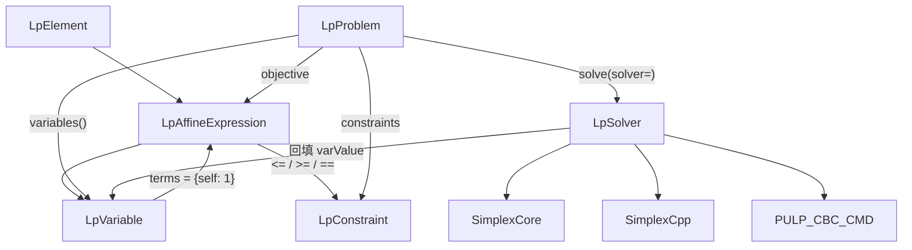

# API 参考

minipulp 的公开 API，与 PuLP 兼容。

本页按模块组织，每个类和方法包含：**签名 → 参数 → 返回值 → 异常 → 示例**。

---

## 目录

- [顶层导入](#顶层导入)
- [变量](#变量)
    - [`LpVariable`](#lpvariable)
    - [`LpVariable.dicts`](#lpvariabledicts)
    - [`LpVariable.matrix`](#lpvariablematrix)
- [表达式](#表达式)
    - [`LpElement`](#lpelement)
    - [`LpAffineExpression`](#lpaffineexpression)
    - [`lpSum`](#lpsum)
- [约束](#约束)
    - [`LpConstraint`](#lpconstraint)
- [问题](#问题)
    - [`LpProblem`](#lpproblem)
- [I/O](#io)
    - [`write_lp`](#write_lp)
- [常量](#常量)
    - [`LpSense`](#lpsense)
    - [`LpCat`](#lpcat)
    - [`LpConstraintSense`](#lpconstraintsense)
    - [`LpStatus`](#lpstatus)
- [求解器](#求解器)
    - [`LpSolver`](#lpsolver)
    - [`SimplexCore`](#simplexcore)
    - [`SimplexCpp`](#simplexcpp)
    - [`PULP_CBC_CMD`](#pulp_cbc_cmd)
- [完整 API 速查表](#完整-api-速查表)

---

## 顶层导入

```python
import minipulp as mp
```

minipulp 顶层导出全部公开 API，使用方式与 PuLP 兼容：

```python
import minipulp as mp

x = mp.LpVariable("x", lowBound=0)
prob = mp.LpProblem("demo", mp.LpMaximize)
prob += 3 * x
prob.solve()
```

### 导出列表

```python
# 常量
mp.LpSense
mp.LpCat
mp.LpConstraintSense
mp.LpStatus
mp.LpMinimize
mp.LpMaximize
mp.LpContinuous
mp.LpInteger
mp.LpBinary
mp.LpStatusOptimal
mp.LpStatusInfeasible
mp.LpStatusUnbounded
mp.LpStatusNotSolved
mp.LpStatusUndefined
mp.LpStatusToMsg

# 变量与表达式
mp.LpElement
mp.LpVariable
mp.LpAffineExpression
mp.lpSum

# 约束与问题
mp.LpConstraint
mp.LpProblem

# I/O
mp.write_lp

# 求解器（需 from minipulp.solvers import ...）
mp.solvers.SimplexCore
mp.solvers.SimplexCpp
mp.solvers.PULP_CBC_CMD
```

### 版本

```python
mp.__version__  # "0.1.0"
```

---

## 变量

### `LpVariable`

决策变量，继承 [`LpAffineExpression`](#lpaffineexpression)。

数学上，变量 `x` 就是仿射表达式 `1 * x + 0`，即 `terms = {x: 1}, const = 0`。因此 `LpVariable` 继承 `LpAffineExpression`，构造时把自己作为单项系数为 1 的表达式。

#### 签名

```python
LpVariable(name, lowBound=None, upBound=None, cat=LpContinuous)
```

#### 参数

| 参数 | 类型 | 默认值 | 说明 |
|------|------|-------|------|
| `name` | `str` | — | 变量名（唯一标识符，同时作为 `__hash__` 依据） |
| `lowBound` | `float \| None` | `None` | 下界，None 表示无下界（负无穷） |
| `upBound` | `float \| None` | `None` | 上界，None 表示无上界（正无穷） |
| `cat` | `LpCat` | `LpContinuous` | 变量类别 |

#### 异常

| 异常 | 条件 |
|------|------|
| （无） | 构造不抛异常，但同名变量会被字典视为同一 key |

!!! warning "变量名唯一性"

    `name` 同时作为 `__hash__` 的依据，因此**同名变量会被字典视为同一 key**。不要创建同名变量。

#### 属性

| 属性 | 类型 | 说明 |
|------|------|------|
| `name` | `str` | 变量名 |
| `lowBound` | `float \| None` | 下界 |
| `upBound` | `float \| None` | 上界 |
| `cat` | `LpCat` | 变量类别 |
| `varValue` | `float \| None` | 求解后回填的解值，求解前为 None |
| `terms` | `dict[LpVariable, float]` | 系数字典，构造为 `{self: 1.0}` |
| `const` | `float` | 常数项，构造为 `0.0` |

#### 运算符

继承自 `LpAffineExpression`，支持全部代数运算：

| 运算 | 示例 | 结果 |
|------|------|------|
| `var + var` | `x + y` | `LpAffineExpression({x:1, y:1})` |
| `var + num` | `x + 5` | `LpAffineExpression({x:1}, c=5)` |
| `num * var` | `3 * x` | `LpAffineExpression({x:3})` |
| `var - var` | `x - y` | `LpAffineExpression({x:1, y:-1})` |
| `var / num` | `x / 2` | `LpAffineExpression({x:0.5})` |
| `-var` | `-x` | `LpAffineExpression({x:-1})` |
| `var <= num` | `x <= 5` | `LpConstraint(x-5, LE)` |
| `var >= num` | `x >= 5` | `LpConstraint(x-5, GE)` |
| `var == num` | `x == 5` | `LpConstraint(x-5, EQ)` |

#### 示例

```python
import minipulp as mp

# 连续变量，下界 0
x = mp.LpVariable("x", lowBound=0)

# 连续变量，0 <= y <= 10
y = mp.LpVariable("y", lowBound=0, upBound=10)

# 整数变量
z = mp.LpVariable("z", lowBound=0, cat=mp.LpInteger)

# 二元变量
b = mp.LpVariable("b", cat=mp.LpBinary)

# 自由变量（无上下界）
free = mp.LpVariable("free")
```

#### 求解后访问

```python
prob.solve()
print(x.varValue)  # 求解后回填的值
```

!!! note "varValue 的回填"

    `varValue` 由求解器在 `solve()` 后回填。求解前为 `None`。如果求解失败（不可行 / 无界），`varValue` 仍为 `None`。

---

### `LpVariable.dicts`

批量创建一维变量字典。

#### 签名

```python
@classmethod
LpVariable.dicts(name, indices, lowBound=None, upBound=None, cat=LpContinuous) -> dict
```

#### 参数

| 参数 | 类型 | 默认值 | 说明 |
|------|------|-------|------|
| `name` | `str` | — | 变量名前缀，实际变量名为 `f"{name}_{index}"` |
| `indices` | `iterable` | — | 索引集合，每个索引对应一个变量 |
| `lowBound` | `float \| None` | `None` | 下界 |
| `upBound` | `float \| None` | `None` | 上界 |
| `cat` | `LpCat` | `LpContinuous` | 变量类别 |

#### 返回值

`dict[index, LpVariable]`：索引到变量的映射。

#### 示例

```python
import minipulp as mp

# 用 range 作为索引
x = mp.LpVariable.dicts("x", range(10), lowBound=0)
# x[0].name == "x_0", x[1].name == "x_1", ..., x[9].name == "x_9"

# 用字符串列表作为索引
y = mp.LpVariable.dicts("y", ["a", "b", "c"], lowBound=0, cat=mp.LpBinary)
# y["a"].name == "y_a", y["b"].name == "y_b", y["c"].name == "y_c"

# 用元组作为索引
z = mp.LpVariable.dicts("z", [(i, j) for i in range(3) for j in range(3)], lowBound=0)
# z[(0, 0)].name == "z_(0, 0)"
```

#### 在约束中使用

```python
n = 5
x = mp.LpVariable.dicts("x", range(n), lowBound=0)

prob = mp.LpProblem("demo", mp.LpMinimize)
prob += mp.lpSum(x[i] for i in range(n))
for i in range(n - 1):
    prob += x[i] + x[i + 1] >= 1
```

---

### `LpVariable.matrix`

批量创建二维变量矩阵。

#### 签名

```python
@classmethod
LpVariable.matrix(name, rows, cols, lowBound=None, upBound=None, cat=LpContinuous) -> dict
```

#### 参数

| 参数 | 类型 | 默认值 | 说明 |
|------|------|-------|------|
| `name` | `str` | — | 变量名前缀 |
| `rows` | `iterable` | — | 行索引集合 |
| `cols` | `iterable` | — | 列索引集合 |
| `lowBound` | `float \| None` | `None` | 下界 |
| `upBound` | `float \| None` | `None` | 上界 |
| `cat` | `LpCat` | `LpContinuous` | 变量类别 |

#### 返回值

`dict[row, dict[col, LpVariable]]`：嵌套字典。变量名为 `f"{name}_{row}_{col}"`。

#### 示例

```python
import minipulp as mp

# 3x4 矩阵
x = mp.LpVariable.matrix("x", range(3), range(4), lowBound=0)
# x[0][0].name == "x_0_0"
# x[2][3].name == "x_2_3"

# 用字符串索引
y = mp.LpVariable.matrix("y", ["r1", "r2"], ["c1", "c2", "c3"], cat=mp.LpBinary)
# y["r1"]["c1"].name == "y_r1_c1"
```

#### 在运输问题中使用

```python
supply = ["f1", "f2", "f3"]
demand = ["c1", "c2", "c3", "c4"]

x = mp.LpVariable.matrix("x", supply, demand, lowBound=0)

prob = mp.LpProblem("transport", mp.LpMinimize)
prob += mp.lpSum(cost[i][j] * x[i][j] for i in supply for j in demand)

for i in supply:
    prob += mp.lpSum(x[i][j] for j in demand) <= supply_cap[i]
for j in demand:
    prob += mp.lpSum(x[i][j] for i in supply) >= demand_req[j]
```

---

## 表达式

### `LpElement`

所有可参与代数运算对象的基类。

`LpElement` 定义运算符协议。子类通过重载这些方法，让 `3 * x + 2 * y` 这样的 Python 表达式直接构造出 `LpAffineExpression({x: 3, y: 2})` 对象，而非做数值计算——这是"代数表达式即代码"的核心机制。

#### 继承关系

```
LpElement ──> LpAffineExpression ──> LpVariable
```

#### 运算符协议

| 方法 | 用途 |
|------|------|
| `__add__` / `__radd__` | 加法 |
| `__sub__` / `__rsub__` | 减法 |
| `__mul__` / `__rmul__` | 乘法（仅数乘） |
| `__truediv__` | 除法（仅除以数） |
| `__neg__` | 取负 |
| `__le__` / `__ge__` / `__eq__` | 比较运算符，构造约束 |

#### `__eq__` 的特殊性

建模库必须重载 `__eq__` 以支持 `x == y` 构造等式约束。但这会覆盖默认的相等性判断，影响对象作为字典 key 的行为。本库的处理：

1. `__hash__` 基于 `name`（变量）或 `id`（表达式），保证可哈希
2. 字典查找时，Python 先用 `is`（指针相等）判断，再用 `__eq__`
3. 同一变量对象作为 key 时 `is` 命中，不会误触发 `__eq__`
4. 不同变量 `name` 不同 → `hash` 不同 → 不会触发 `__eq__`

因此**只要不创建同名变量**，字典行为安全。

#### 属性

| 属性 | 类型 | 说明 |
|------|------|------|
| `name` | `str` | 对象名，默认空字符串 |

#### 示例

通常不直接使用 `LpElement`，而是用其子类 `LpAffineExpression` 和 `LpVariable`。

```python
from minipulp import LpElement

# LpElement 是抽象基类，不应直接实例化
# elem = LpElement()  # 可以实例化但没有代数能力
```

---

### `LpAffineExpression`

仿射表达式：`sum(coef_i * var_i) + const`。

内部表示为 `{LpVariable: float}` 字典 + 一个常数项 `const`。这种表示的合法性来自仿射表达式在加法、数乘下的**闭包性**：

- 两个仿射表达式相加，结果仍是仿射表达式（字典系数相加）
- 仿射表达式乘以常数，结果仍是仿射表达式（系数同乘）

因此无需表达式树，一个扁平字典就够了。

#### 签名

```python
LpAffineExpression(terms=None, const=0.0)
```

#### 参数

| 参数 | 类型 | 默认值 | 说明 |
|------|------|-------|------|
| `terms` | `dict[LpVariable, float] \| None` | `None` | 变量到系数的映射。None 表示空（纯常数） |
| `const` | `float` | `0.0` | 常数项 |

#### 异常

| 异常 | 条件 |
|------|------|
| `TypeError` | 两个含变量的表达式相乘（非线性） |
| `ZeroDivisionError` | 表达式除以零 |

#### 属性

| 属性 | 类型 | 说明 |
|------|------|------|
| `terms` | `dict[LpVariable, float]` | 变量系数字典（构造时剔除零系数项） |
| `const` | `float` | 常数项 |

#### 方法

##### `value()`

```python
value() -> float | None
```

在变量已被求解（`varValue` 已回填）时计算表达式的值。任一变量未求解则返回 None。

**返回**：`float | None`

```python
x = mp.LpVariable("x", lowBound=0)
y = mp.LpVariable("y", lowBound=0)
expr = 3 * x + 2 * y

# 求解前
print(expr.value())  # None

# 求解后
prob.solve()
print(expr.value())  # 3 * x.varValue + 2 * y.varValue
```

##### `is_constant()`

```python
is_constant() -> bool
```

是否为纯常数（无变量项）。

**返回**：`bool`

```python
expr1 = mp.LpAffineExpression({}, 5.0)
print(expr1.is_constant())  # True

x = mp.LpVariable("x")
expr2 = 3 * x + 5
print(expr2.is_constant())  # False
```

#### 运算符

| 运算 | 示例 | 结果 | 说明 |
|------|------|------|------|
| `expr + expr` | `x + y` | `LpAffineExpression` | 合并同类项 |
| `expr + num` | `x + 5` | `LpAffineExpression` | 加到常数项 |
| `num + expr` | `5 + x` | `LpAffineExpression` | 交换律 |
| `expr - expr` | `x - y` | `LpAffineExpression` | 合并同类项 |
| `expr - num` | `x - 5` | `LpAffineExpression` | 减常数项 |
| `num - expr` | `5 - x` | `LpAffineExpression` | 反向减 |
| `num * expr` | `3 * x` | `LpAffineExpression` | 数乘 |
| `expr * num` | `x * 3` | `LpAffineExpression` | 交换律 |
| `expr / num` | `x / 2` | `LpAffineExpression` | 除以非零数 |
| `-expr` | `-x` | `LpAffineExpression` | 取负 |
| `expr <= num` | `x <= 5` | `LpConstraint` | 构造 ≤ 约束 |
| `expr >= num` | `x >= 5` | `LpConstraint` | 构造 ≥ 约束 |
| `expr == num` | `x == 5` | `LpConstraint` | 构造 = 约束 |

#### 非线性运算的限制

```python
x = mp.LpVariable("x")
y = mp.LpVariable("y")

x * y  # TypeError: 不能将两个含变量的表达式相乘（非线性）
x ** 2  # 同样不支持
```

线性规划只允许仿射表达式，变量相乘是非线性的。

#### 示例

```python
import minipulp as mp

x = mp.LpVariable("x")
y = mp.LpVariable("y")

# 构造
expr1 = mp.LpAffineExpression({x: 3, y: 2}, 5.0)  # 3x + 2y + 5
expr2 = 3 * x + 2 * y + 5                          # 等价

# 运算
expr3 = expr1 + x          # 4x + 2y + 5
expr4 = 2 * expr1          # 6x + 4y + 10
expr5 = expr1 - y          # 3x + y + 5
expr6 = -expr1             # -3x - 2y - 5
expr7 = expr1 / 2          # 1.5x + y + 2.5

# 查询
print(expr1.terms)         # {x: 3.0, y: 2.0}
print(expr1.const)         # 5.0
print(expr1.is_constant()) # False

# 比较运算符构造约束
con = expr1 <= 100  # LpConstraint
```

---

### `lpSum`

高效求和函数，避免 `sum()` 的中间对象创建。

#### 签名

```python
lpSum(vector) -> LpAffineExpression
```

#### 参数

| 参数 | 类型 | 说明 |
|------|------|------|
| `vector` | `iterable` | 一组仿射表达式或数值 |

#### 返回值

`LpAffineExpression`：所有项的和。

#### 性能说明

对于大规模问题（如运输问题有数百变量），`lpSum` 比 `sum()` 快得多：

- `sum([3*x, 2*y, 5])` 等价于 `((0 + 3*x) + 2*y) + 5`，每次 `+` 都创建一个新 `LpAffineExpression`，n 个表达式求和要构造 n 个中间对象
- `lpSum` 直接遍历一次，合并到一个字典里，只构造一次

#### 示例

```python
import minipulp as mp

x = mp.LpVariable("x")
y = mp.LpVariable("y")

# 列表
expr = mp.lpSum([3 * x, 2 * y, 5])  # 3*x + 2*y + 5

# 生成器（推荐，省内存）
n = 100
xs = mp.LpVariable.dicts("x", range(n), lowBound=0)
expr = mp.lpSum(xs[i] for i in range(n))

# 带系数
cost = [1, 2, 3, 4, 5]
x = mp.LpVariable.dicts("x", range(5), lowBound=0)
expr = mp.lpSum(cost[i] * x[i] for i in range(5))

# 混合数值与表达式
expr = mp.lpSum([x, y, 3, 4])  # x + y + 7

# 空列表
expr = mp.lpSum([])  # LpAffineExpression()，即 0
```

#### 在约束中使用

```python
prob += mp.lpSum(cost[i] * x[i] for i in range(n)) <= budget
```

---

## 约束

### `LpConstraint`

线性约束：`lhs (<=|==|>=) 0`。

通常由运算符自动构造，不直接实例化。

#### 签名

```python
LpConstraint(lhs, sense=LpConstraintSense.LE, name=None)
```

#### 参数

| 参数 | 类型 | 默认值 | 说明 |
|------|------|-------|------|
| `lhs` | `LpAffineExpression` | — | 归一化后的左侧表达式（已把右端项移到左边） |
| `sense` | `LpConstraintSense` | `LE` | 比较方向 |
| `name` | `str \| None` | `None` | 约束名（由 `LpProblem` 在添加时自动分配） |

#### 归一化约定

用户写的 `3*x + 2*y <= 10` 在内部被归一化为：

```python
LpConstraint(lhs=LpAffineExpression({x: 3, y: 2}, const=-10), sense=LE)
```

即 `lhs <= 0` 的齐次形式。这一归一化让求解器只需处理一种形式。

#### 属性

| 属性 | 类型 | 说明 |
|------|------|------|
| `lhs` | `LpAffineExpression` | 归一化后的左侧表达式 |
| `sense` | `LpConstraintSense` | 比较方向 |
| `name` | `str \| None` | 约束名 |

#### 只读属性

| 属性 | 类型 | 说明 |
|------|------|------|
| `expression` | `LpAffineExpression` | 同 `lhs` |
| `constant` | `float` | 左侧表达式的常数项（即负的右端项） |
| `terms` | `dict` | 左侧表达式的变量系数字典 |

#### 示例

```python
import minipulp as mp

x = mp.LpVariable("x")
y = mp.LpVariable("y")

# 由运算符构造
con1 = 2 * x + y <= 100   # LpConstraint, sense=LE
con2 = x - y >= 0         # LpConstraint, sense=GE
con3 = x + y == 10        # LpConstraint, sense=EQ

# 查询
print(con1.lhs)       # 2.0*x + 1.0*y - 100.0
print(con1.sense)     # LpConstraintSense.LE
print(con1.constant)  # -100.0
print(con1.terms)     # {x: 2.0, y: 1.0}

# 直接构造（通常不需要）
con4 = mp.LpConstraint(2 * x + y - 100, mp.LpConstraintSense.LE)
```

#### 添加到问题

```python
prob = mp.LpProblem("demo")
prob += 2 * x + y <= 100           # 用 += 语法糖
prob.addConstraint(2 * x + y <= 100, name="supply")  # 显式方法
```

---

## 问题

### `LpProblem`

线性规划问题容器。

`LpProblem` 是用户建模的入口，职责清晰分为三层：

1. **收集** — 用 `+=` 语法糖或显式方法添加目标函数与约束
2. **表示** — 维护变量表、约束表，提供 `variables()` 等查询
3. **委托** — `solve(solver)` 把问题交给求解器，求解器回填解值

#### 签名

```python
LpProblem(name="problem", sense=LpMinimize)
```

#### 参数

| 参数 | 类型 | 默认值 | 说明 |
|------|------|-------|------|
| `name` | `str` | `"problem"` | 问题名，用于 LP 文件输出与日志 |
| `sense` | `LpSense` | `LpMinimize` | 目标方向 |

#### 属性

| 属性 | 类型 | 说明 |
|------|------|------|
| `name` | `str` | 问题名 |
| `sense` | `LpSense` | 目标方向 |
| `objective` | `LpAffineExpression \| None` | 目标函数，未设置时为 None |
| `constraints` | `dict[str, LpConstraint]` | 约束字典，键为约束名 |
| `status` | `LpStatus` | 求解状态，初始为 `NOT_SOLVED` |
| `status_msg` | `str` | 求解状态的可读消息（property） |

#### 方法

##### `addConstraint(constraint, name=None)`

添加约束。

| 参数 | 类型 | 说明 |
|------|------|------|
| `constraint` | `LpConstraint` | 约束对象 |
| `name` | `str \| None` | 约束名，None 时自动分配 `c_N` |

```python
prob.addConstraint(2 * x + y <= 100, name="supply")
prob.addConstraint(x + y <= 80)  # 自动命名 c_0, c_1, ...
```

##### `setObjective(expr)`

设置目标函数。

| 参数 | 类型 | 说明 |
|------|------|------|
| `expr` | `LpAffineExpression \| LpVariable` | 目标表达式 |

```python
prob.setObjective(3 * x + 2 * y)
prob.setObjective(x)  # 单变量
```

##### `addVariable(var)`

注册一个变量到问题变量表。重复添加同名变量会被忽略。

| 参数 | 类型 | 说明 |
|------|------|------|
| `var` | `LpVariable` | 变量对象 |

```python
prob.addVariable(x)
```

!!! note "自动注册"

    `addConstraint` 和 `setObjective` 会自动注册涉及的变量，通常不需要手动调 `addVariable`。

##### `variables()`

返回问题中所有变量（按添加顺序）。

**返回**：`list[LpVariable]`

```python
vars = prob.variables()
print(len(vars))  # 变量数
for v in vars:
    print(v.name, v.varValue)
```

##### `numVariables()`

返回变量数。

**返回**：`int`

##### `numConstraints()`

返回约束数。

**返回**：`int`

##### `solve(solver=None)`

求解问题。

| 参数 | 类型 | 说明 |
|------|------|------|
| `solver` | `LpSolver \| None` | 求解器实例，None 时使用默认求解器 |

**返回**：`LpStatus`

**默认求解器策略**：

1. `SimplexCpp`（如果 C++ 扩展可用，快 10–50×）
2. `SimplexCore`（纯 Python，零依赖兜底）

```python
prob.solve()                          # 默认求解器
prob.solve(solver=SimplexCore())      # 纯 Python
prob.solve(solver=SimplexCpp())       # C++
prob.solve(solver=PULP_CBC_CMD())     # CBC
```

##### `valid()`

检查问题是否已设置目标函数。

**返回**：`bool`

```python
if not prob.valid():
    print("未设置目标函数")
```

##### `__iadd__(other)`

`+=` 语法糖：表达式→目标，约束→添加约束。

| 参数 | 类型 | 说明 |
|------|------|------|
| `other` | `LpConstraint \| LpAffineExpression \| LpVariable` | 要添加的对象 |

**异常**：`TypeError` — 不支持的类型

```python
prob += 3 * x + 2 * y          # 设置目标
prob += 2 * x + y <= 100       # 添加约束
prob += x                       # 单变量目标
```

#### 完整示例

```python
import minipulp as mp

x = mp.LpVariable("x", lowBound=0)
y = mp.LpVariable("y", lowBound=0)

prob = mp.LpProblem("demo", mp.LpMaximize)
prob += 3 * x + 2 * y
prob += 2 * x + y <= 100
prob += x + y <= 80
prob += x <= 40

print(f"变量数: {prob.numVariables()}")     # 2
print(f"约束数: {prob.numConstraints()}")   # 3
print(f"有效: {prob.valid()}")              # True

prob.solve()
print(f"状态: {prob.status_msg}")           # Optimal
print(f"目标值: {prob.objective.value()}")  # 180.0
print(f"x = {x.varValue}")                  # 20.0
print(f"y = {y.varValue}")                  # 60.0
```

#### 查询约束

```python
for name, con in prob.constraints.items():
    print(f"{name}: {con}")
```

#### 查询变量

```python
for v in prob.variables():
    print(f"{v.name} = {v.varValue}")
```

---

## I/O

### `write_lp`

将问题序列化为 CPLEX LP 格式文本。

#### 签名

```python
write_lp(problem) -> str
```

#### 参数

| 参数 | 类型 | 说明 |
|------|------|------|
| `problem` | `LpProblem` | 要序列化的问题 |

#### 返回值

`str`：CPLEX LP 格式的文本。

#### LP 文件格式

CPLEX LP 格式是工业标准，结构如下：

```text
\* problem_name *\
Maximize / Minimize
  <objective>
Subject To
  <constraints>
Bounds
  <bounds>
General / Integer / Binary
  <integer/binary variables>
End
```

#### 示例

```python
import minipulp as mp

x = mp.LpVariable("x", lowBound=0, upBound=40)
y = mp.LpVariable("y", lowBound=0)

prob = mp.LpProblem("demo", mp.LpMaximize)
prob += 3 * x + 2 * y
prob += 2 * x + y <= 100
prob += x + y <= 80

text = mp.write_lp(prob)
print(text)
```

输出：

```text
\* demo *\
Maximize
  3 x + 2 y
Subject To
  c0: 2 x + 1 y <= 100
  c1: 1 x + 1 y <= 80
Bounds
  0 <= x <= 40
  0 <= y
End
```

#### 保存到文件

```python
with open("problem.lp", "w") as f:
    f.write(mp.write_lp(prob))

# 用外部求解器求解
# $ cbc problem.lp solve solution.sol
```

#### 与 PuLP 的差异

PuLP 用方法 `prob.writeLP(filename)`，minipulp 用顶层函数 `write_lp(prob)` 返回字符串。

```python
# PuLP
prob.writeLP("problem.lp")

# minipulp
with open("problem.lp", "w") as f:
    f.write(mp.write_lp(prob))
```

---

## 常量

### `LpSense`

目标函数方向（求最大化还是最小化）。

```python
class LpSense(IntEnum):
    MINIMIZE = 1
    MAXIMIZE = -1
```

#### 别名

```python
mp.LpMinimize  # LpSense.MINIMIZE (1)
mp.LpMaximize  # LpSense.MAXIMIZE (-1)
```

#### 使用

```python
prob = mp.LpProblem("min_demo", mp.LpMinimize)  # 最小化
prob = mp.LpProblem("max_demo", mp.LpMaximize)  # 最大化
```

#### 为什么 MAXIMIZE = -1？

内部统一用最小化求解。最大化问题 `max c^T x` 转为最小化 `min -c^T x`。`MAXIMIZE = -1` 让目标系数乘以 `sense` 即得最小化形式。

---

### `LpCat`

变量类别（连续、整数、二元）。

```python
class LpCat(IntEnum):
    CONTINUOUS = 0
    INTEGER = 1
    BINARY = 2
```

#### 别名

```python
mp.LpContinuous  # LpCat.CONTINUOUS (0)
mp.LpInteger     # LpCat.INTEGER (1)
mp.LpBinary      # LpCat.BINARY (2)
```

#### 使用

```python
x = mp.LpVariable("x", lowBound=0, cat=mp.LpContinuous)  # 连续（默认）
z = mp.LpVariable("z", lowBound=0, cat=mp.LpInteger)     # 整数
b = mp.LpVariable("b", cat=mp.LpBinary)                  # 二元（0/1）
```

#### 求解器要求

| 类别 | SimplexCore | SimplexCpp | PULP_CBC_CMD |
|------|:-----------:|:----------:|:------------:|
| Continuous | :white_check_mark: | :white_check_mark: | :white_check_mark: |
| Integer | :x: | :x: | :white_check_mark: |
| Binary | :x: | :x: | :white_check_mark: |

!!! note "Binary 等价于 Integer + 0/1 界"

    `LpBinary` 等价于 `LpInteger` + `lowBound=0` + `upBound=1`。求解器内部这样处理。

---

### `LpConstraintSense`

约束方向。

```python
class LpConstraintSense(IntEnum):
    LE = 0   # <=
    EQ = 1   # ==
    GE = 2   # >=
```

#### 使用

通常由运算符自动构造，不直接使用：

```python
con1 = 2 * x + y <= 100   # sense = LpConstraintSense.LE
con2 = x + y == 10        # sense = LpConstraintSense.EQ
con3 = x - y >= 0         # sense = LpConstraintSense.GE
```

直接构造：

```python
con = mp.LpConstraint(2 * x + y - 100, mp.LpConstraintSense.LE)
```

#### 归一化

约束在内部统一归一化为 `lhs <= 0` / `lhs >= 0` / `lhs == 0` 形式：

- `2*x + y <= 100` → `LpConstraint(2*x + y - 100, LE)`
- `x + y == 10` → `LpConstraint(x + y - 10, EQ)`
- `x - y >= 0` → `LpConstraint(x - y, GE)`

---

### `LpStatus`

求解状态码。采用与 PuLP 兼容的整数编码。

```python
class LpStatus(IntEnum):
    NOT_SOLVED = 0
    OPTIMAL = 1
    INFEASIBLE = -1
    UNBOUNDED = -2
    UNDEFINED = -3
    INFEASIBLE_OR_UNBOUNDED = -4
```

#### 别名

```python
mp.LpStatusOptimal     # LpStatus.OPTIMAL (1)
mp.LpStatusInfeasible  # LpStatus.INFEASIBLE (-1)
mp.LpStatusUnbounded   # LpStatus.UNBOUNDED (-2)
mp.LpStatusNotSolved   # LpStatus.NOT_SOLVED (0)
mp.LpStatusUndefined   # LpStatus.UNDEFINED (-3)
```

#### 状态消息映射

```python
mp.LpStatusToMsg = {
    LpStatus.NOT_SOLVED: "Not Solved",
    LpStatus.OPTIMAL: "Optimal",
    LpStatus.INFEASIBLE: "Infeasible",
    LpStatus.UNBOUNDED: "Unbounded",
    LpStatus.UNDEFINED: "Undefined",
    LpStatus.INFEASIBLE_OR_UNBOUNDED: "Infeasible or Unbounded",
}
```

#### 使用

```python
prob.solve()

if prob.status == mp.LpStatusOptimal:
    print("找到最优解")
elif prob.status == mp.LpStatusInfeasible:
    print("问题不可行")
elif prob.status == mp.LpStatusUnbounded:
    print("问题无界")
else:
    print(f"状态: {prob.status_msg}")
```

#### 状态含义

| 状态 | 含义 |
|------|------|
| `NOT_SOLVED` | 尚未求解 |
| `OPTIMAL` | 找到最优解 |
| `INFEASIBLE` | 约束矛盾，无可行解 |
| `UNBOUNDED` | 目标函数无界（可无限优化） |
| `UNDEFINED` | 求解器返回未定义状态 |
| `INFEASIBLE_OR_UNBOUNDED` | 求解器无法区分不可行或无界 |

---

## 求解器

所有求解器继承抽象基类 `LpSolver`，实现 `available()` 和 `actualSolve(problem)` 方法。

```python
from minipulp.solvers import SimplexCore, SimplexCpp, PULP_CBC_CMD
```

### `LpSolver`

求解器抽象基类。

#### 方法

##### `available() -> bool`

检查求解器是否可用（依赖是否安装）。

```python
print(SimplexCore().available())   # 总是 True
print(SimplexCpp().available())    # 取决于是否编译
print(PULP_CBC_CMD().available())  # 取决于 CBC 是否安装
```

##### `solve(problem) -> LpStatus`

求解问题，回填变量值，返回状态码。

通常不直接调用，而是通过 `prob.solve(solver=...)`：

```python
prob.solve(solver=SimplexCore())
# 等价于
# solver = SimplexCore()
# status = solver.solve(prob)
```

---

### `SimplexCore`

纯 Python 两阶段单纯形法求解器。

#### 签名

```python
SimplexCore()
```

#### 特点

- **纯 Python 实现**，零依赖
- **两阶段单纯形法**：阶段 1 找可行基，阶段 2 优化
- **教学透明**：可断点调试，看清楚主元选择、转轴、基变量更新
- **不支持整数变量**

#### 使用

```python
from minipulp.solvers import SimplexCore

prob.solve(solver=SimplexCore())
```

#### 适用场景

- 教学演示
- 小规模连续 LP（< 100 变量）
- 调试问题建模

#### 性能

纯 Python 实现，比 C++ 慢 10–50×。大规模问题请用 `SimplexCpp` 或 `PULP_CBC_CMD`。

#### 示例

```python
import minipulp as mp
from minipulp.solvers import SimplexCore

x = mp.LpVariable("x", lowBound=0)
y = mp.LpVariable("y", lowBound=0)

prob = mp.LpProblem("demo", mp.LpMaximize)
prob += 3 * x + 2 * y
prob += 2 * x + y <= 100
prob += x + y <= 80

prob.solve(solver=SimplexCore())
print(prob.status_msg)  # Optimal
print(x.varValue, y.varValue)
```

---

### `SimplexCpp`

C++ 两阶段单纯形法求解器（需编译 `_native` 扩展）。

#### 签名

```python
SimplexCpp()
```

#### 特点

- **C++ 实现**，通过 pybind11 绑定到 Python
- **两阶段单纯形法**，算法与 `SimplexCore` 相同
- **性能比 SimplexCore 快 10–50×**
- **不支持整数变量**
- **需编译**：调用 `available()` 返回 False 时需先编译

#### 编译

```bash
python -m minipulp.core.build
```

#### 使用

```python
from minipulp.solvers import SimplexCpp

if SimplexCpp().available():
    prob.solve(solver=SimplexCpp())
else:
    print("C++ 扩展未编译，回退到 SimplexCore")
    prob.solve(solver=SimplexCore())
```

#### 适用场景

- 中规模连续 LP（100–10000 变量）
- 需要性能但不依赖外部求解器的场景

#### 示例

```python
import minipulp as mp
from minipulp.solvers import SimplexCpp

x = mp.LpVariable("x", lowBound=0)
y = mp.LpVariable("y", lowBound=0)

prob = mp.LpProblem("demo", mp.LpMaximize)
prob += 3 * x + 2 * y
prob += 2 * x + y <= 100
prob += x + y <= 80

prob.solve(solver=SimplexCpp())
print(prob.status_msg)
```

---

### `PULP_CBC_CMD`

CBC 命令行求解器（需安装 [CBC](https://github.com/coin-or/Cbc)）。

#### 签名

```python
PULP_CBC_CMD(path=None, msg=False, timeLimit=None)
```

#### 参数

| 参数 | 类型 | 默认值 | 说明 |
|------|------|-------|------|
| `path` | `str \| None` | `None` | CBC 可执行文件路径，None 时自动查找 |
| `msg` | `bool` | `False` | 是否显示 CBC 输出 |
| `timeLimit` | `int \| None` | `None` | 时间上限（秒），None 表示无限制 |

#### 特点

- **外部进程**：通过子进程调用 CBC 命令行
- **支持整数规划**：连续 / 整数 / 二元变量
- **工业级通信范式**：生成 .lp → 调 cbc → 解析 .sol
- **需安装 CBC**

#### 通信流程

```
LpProblem ──write_lp──> problem.lp ──cbc──> solution.sol ──parse──> 回填 varValue
```

1. `write_lp` 把问题序列化为 CPLEX LP 格式
2. 调用 `cbc problem.lp solve solution.sol`
3. 解析 `.sol` 文件，回填变量值

#### 使用

```python
from minipulp.solvers import PULP_CBC_CMD

# 基本用法
prob.solve(solver=PULP_CBC_CMD())

# 显示 CBC 输出
prob.solve(solver=PULP_CBC_CMD(msg=True))

# 时间限制
prob.solve(solver=PULP_CBC_CMD(timeLimit=60))

# 指定 CBC 路径
prob.solve(solver=PULP_CBC_CMD(path="/usr/local/bin/cbc"))
```

#### 适用场景

- 整数规划 / 混合整数规划
- 大规模问题
- 需要工业级求解器的场景

#### 示例：整数规划

```python
import minipulp as mp
from minipulp.solvers import PULP_CBC_CMD

x = mp.LpVariable("x", lowBound=0, cat=mp.LpInteger)
y = mp.LpVariable("y", lowBound=0, cat=mp.LpInteger)

prob = mp.LpProblem("mip", mp.LpMaximize)
prob += 3 * x + 2 * y
prob += 2 * x + y <= 100
prob += x + y <= 80

prob.solve(solver=PULP_CBC_CMD())
print(prob.status_msg)
print(x.varValue, y.varValue)
```

#### 示例：二元变量

```python
x = mp.LpVariable("x", cat=mp.LpBinary)
y = mp.LpVariable("y", cat=mp.LpBinary)

prob = mp.LpProblem("binary", mp.LpMaximize)
prob += 3 * x + 2 * y
prob += x + y <= 1  # 互斥

prob.solve(solver=PULP_CBC_CMD())
```

#### 安装 CBC

=== "Windows"

    ```bash
    conda install -c conda-forge coincbc
    ```

=== "macOS"

    ```bash
    brew install coin-or-tools/coinor/cbc
    ```

=== "Linux"

    ```bash
    sudo apt-get install coinor-cbc
    ```

验证：

```bash
cbc -version
```

---

## 完整 API 速查表

### 变量

```python
mp.LpVariable(name, lowBound=None, upBound=None, cat=LpContinuous)
mp.LpVariable.dicts(name, indices, lowBound=None, upBound=None, cat=LpContinuous)
mp.LpVariable.matrix(name, rows, cols, lowBound=None, upBound=None, cat=LpContinuous)
```

### 表达式

```python
mp.LpElement                    # 抽象基类
mp.LpAffineExpression(terms=None, const=0.0)
mp.lpSum(vector)
```

### 约束

```python
mp.LpConstraint(lhs, sense=LpConstraintSense.LE, name=None)
```

### 问题

```python
mp.LpProblem(name="problem", sense=LpMinimize)

prob += expr                    # 设置目标
prob += constraint              # 添加约束
prob.addConstraint(con, name=None)
prob.setObjective(expr)
prob.addVariable(var)
prob.variables()                # -> list[LpVariable]
prob.numVariables()             # -> int
prob.numConstraints()           # -> int
prob.solve(solver=None)         # -> LpStatus
prob.valid()                    # -> bool
```

### I/O

```python
mp.write_lp(problem)            # -> str
```

### 常量

```python
# 目标方向
mp.LpMinimize                   # 1
mp.LpMaximize                   # -1

# 变量类别
mp.LpContinuous                 # 0
mp.LpInteger                    # 1
mp.LpBinary                     # 2

# 求解状态
mp.LpStatusOptimal              # 1
mp.LpStatusInfeasible           # -1
mp.LpStatusUnbounded            # -2
mp.LpStatusNotSolved            # 0
mp.LpStatusUndefined            # -3

# 状态消息映射
mp.LpStatusToMsg                # dict[LpStatus, str]

# 枚举类
mp.LpSense                      # IntEnum
mp.LpCat                        # IntEnum
mp.LpConstraintSense            # IntEnum
mp.LpStatus                     # IntEnum
```

### 求解器

```python
from minipulp.solvers import LpSolver, SimplexCore, SimplexCpp, PULP_CBC_CMD

# 检查可用性
solver.available()              # -> bool

# 求解
prob.solve(solver=solver)       # -> LpStatus

# SimplexCore / SimplexCpp
SimplexCore()
SimplexCpp()

# PULP_CBC_CMD
PULP_CBC_CMD(path=None, msg=False, timeLimit=None)
```

---

## 类型关系图



---

## 运算符重载一览

### `LpElement` 定义的协议

```python
class LpElement:
    def __add__(self, other): ...
    def __radd__(self, other): ...
    def __sub__(self, other): ...
    def __rsub__(self, other): ...
    def __mul__(self, other): ...
    def __rmul__(self, other): ...
    def __truediv__(self, other): ...
    def __neg__(self): ...
    def __le__(self, other): ...   # -> LpConstraint
    def __ge__(self, other): ...   # -> LpConstraint
    def __eq__(self, other): ...   # -> LpConstraint
    def __hash__(self): ...
```

### 运算符调用链

| 表达式 | 调用 | 结果 |
|--------|------|------|
| `3 * x` | `int.__mul__(3, x)` 失败 → `x.__rmul__(3)` | `LpAffineExpression({x: 3})` |
| `x + y` | `x.__add__(y)` | `LpAffineExpression({x: 1, y: 1})` |
| `x + 5` | `x.__add__(5)` | `LpAffineExpression({x: 1}, c=5)` |
| `5 + x` | `int.__add__(5, x)` 失败 → `x.__radd__(5)` | `LpAffineExpression({x: 1}, c=5)` |
| `3*x + 2*y` | 两次 `__rmul__` + 一次 `__add__` | `LpAffineExpression({x: 3, y: 2})` |
| `x <= 5` | `x.__le__(5)` | `LpConstraint(x-5, LE)` |
| `x == y` | `x.__eq__(y)` | `LpConstraint(x-y, EQ)` |
| `-x` | `x.__neg__()` | `LpAffineExpression({x: -1})` |
| `x / 2` | `x.__truediv__(2)` | `LpAffineExpression({x: 0.5})` |

---

## 内部表示

### 表达式的字典表示

```python
x = LpVariable("x")
y = LpVariable("y")

expr = 3 * x + 2 * y + 5
# 内部：
# expr.terms = {x: 3.0, y: 2.0}
# expr.const = 5.0
```

### 约束的归一化

```python
con = 3 * x + 2 * y <= 10
# 内部：
# con.lhs = LpAffineExpression({x: 3, y: 2}, const=-10)
# con.sense = LpConstraintSense.LE
# 即 3x + 2y - 10 <= 0
```

### 问题的内部结构

```python
prob = LpProblem("demo", LpMaximize)
prob += 3 * x + 2 * y
prob += 2 * x + y <= 100

# 内部：
# prob.name = "demo"
# prob.sense = LpMaximize
# prob.objective = LpAffineExpression({x: 3, y: 2})
# prob.constraints = {"c_0": LpConstraint(2x + y - 100, LE)}
# prob._variables = {"x": x, "y": y}
# prob.status = LpStatusNotSolved
```

---

## 与 PuLP 的差异

### 函数式 vs 方法式

| 操作 | PuLP | minipulp |
|------|------|----------|
| 写 LP 文件 | `prob.writeLP("file.lp")` | `open("file.lp", "w").write(mp.write_lp(prob))` |
| 表达式求值 | `pulp.value(expr)` | `expr.value()` |

### 求解器位置

| 求解器 | PuLP | minipulp |
|--------|------|----------|
| CBC | `pulp.PULP_CBC_CMD` | `mp.solvers.PULP_CBC_CMD` |

```python
# PuLP
import pulp
solver = pulp.PULP_CBC_CMD()

# minipulp
import minipulp as mp
from minipulp.solvers import PULP_CBC_CMD
solver = PULP_CBC_CMD()
```

### 不支持的功能

- 对偶解（`prob.dualVars`）
- 敏感性分析
- 列生成
- MPS 文件 I/O
- 多种求解器（GLPK、CPLEX、Gurobi 等）

---

## 错误处理

### 常见异常

| 异常 | 触发条件 | 解决方法 |
|------|---------|---------|
| `TypeError` | 两个含变量表达式相乘 | 线性规划不支持非线性 |
| `TypeError` | `+=` 不支持的类型 | 只能加表达式或约束 |
| `TypeError` | 目标函数类型错误 | 必须是 `LpAffineExpression` |
| `ZeroDivisionError` | 表达式除以零 | 检查除数 |
| `ValueError` | 求解器不可用 | 检查依赖是否安装 |

### 错误示例

```python
# 非线性表达式
x * y  # TypeError: 不能将两个含变量的表达式相乘（非线性）

# 未设置目标
prob = mp.LpProblem("demo")
prob += 2 * x + y <= 100
prob.solve()  # 求解器可能报错或返回未定义状态

# 用错求解器
x = mp.LpVariable("x", cat=mp.LpBinary)
prob.solve(solver=SimplexCore())  # SimplexCore 不支持整数变量
```

---

## 性能建议

### 用 `lpSum` 代替 `sum`

```python
# 推荐
prob += mp.lpSum(cost[i] * x[i] for i in range(n))

# 不推荐（慢）
prob += sum(cost[i] * x[i] for i in range(n))
```

### 用变量上下界代替约束

```python
# 推荐（更高效）
x = mp.LpVariable("x", lowBound=0, upBound=40)

# 不推荐（多一条约束）
x = mp.LpVariable("x", lowBound=0)
prob += x <= 40
```

### 选合适的求解器

```python
# 小规模连续 LP：SimplexCore（零依赖）
prob.solve(solver=SimplexCore())

# 中大规模连续 LP：SimplexCpp（快 10-50x）
prob.solve(solver=SimplexCpp())

# 整数规划 / 大规模：PULP_CBC_CMD
prob.solve(solver=PULP_CBC_CMD())
```

### 避免同名变量

```python
# 错误：同名变量会被字典视为同一 key
x1 = mp.LpVariable("x")
x2 = mp.LpVariable("x")  # 冲突

# 正确：唯一命名
x1 = mp.LpVariable("x1")
x2 = mp.LpVariable("x2")
```

---

## 下一步

- [:octicons-play-24: 示例集合](../examples.md) — 看完整建模示例
- [:octicons-book-24: 教程](../tutorial/phase1-expressions.md) — 从零理解实现
- [:octicons-lightbulb-24: 设计哲学](../principles/philosophy.md) — 理解设计动机
