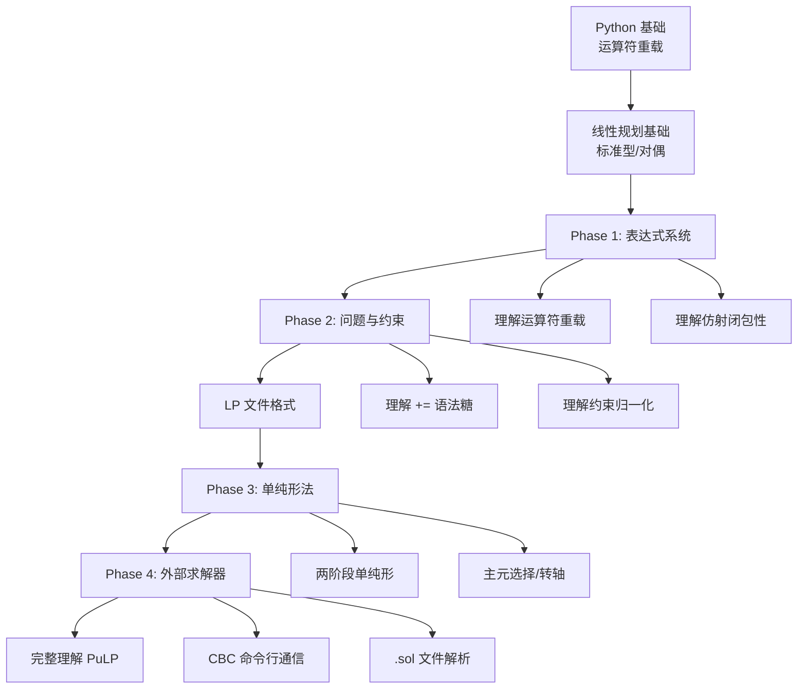
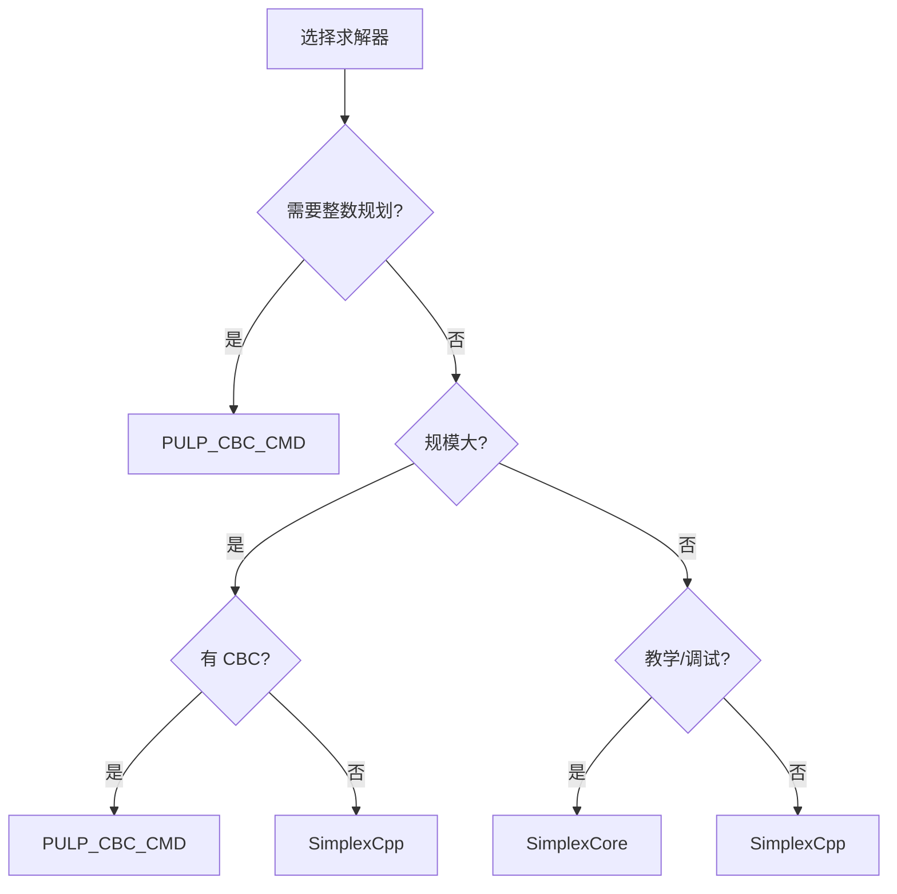

# minipulp — 从零实现 PuLP

> 一个教学项目，从零复刻 [PuLP](https://github.com/coin-or/pulp) 线性规划建模库的核心设计，理解其设计哲学与底层原理。

---

## 为什么有这个项目？

PuLP 是 Python 生态最流行的线性规划建模库之一，但它的源码对初学者并不友好——大量历史包袱、防御性代码、多求解器适配逻辑交织在一起，让人难以抓住主线。

本项目不追求功能完整复刻，而是**聚焦核心设计哲学**，用最透明的代码讲清楚四件事：

1. **建模与求解分离** — `LpProblem` 只描述问题，`LpSolver` 只求解问题，二者通过 LP 文件格式通信。
2. **代数表达式即代码** — 运算符重载让 `3*x + 2*y <= 10` 直接构建表达式对象，而非字符串解析。
3. **仿射表达式的闭包性** — 变量、常数、表达式的线性运算结果仍是仿射表达式，用 `{var: coef}` 字典即可完整表示。
4. **多后端可插拔** — 求解器是一组同接口子类，换求解器只换 `solve(solver=...)` 一个参数。

### 这个项目适合谁？

!!! question "适合人群"

    - 想理解运筹优化建模库内部实现的工程师
    - 在用 PuLP / Pyomo / OR-Tools 但想"知其所以然"的开发者
    - 学习线性规划、单纯形法并希望看到完整可运行代码的学生
    - 想自己实现一个 DSL（领域特定语言）的 Python 程序员
    - 对运算符重载、代数系统闭包性感兴趣的 Pythonista

### 这个项目不适合谁？

- 想要一个**生产级** LP 求解库的人——请直接用 [PuLP](https://github.com/coin-or/pulp) 或 [HiGHS](https://highs.dev)
- 想要最快求解速度的人——教学代码优先透明，不优先性能
- 想要完整 MILP / SOCP / SDP 支持的人——本项目只覆盖 LP 与基础 MILP

---

## 30 秒上手

```python
import minipulp as mp

x = mp.LpVariable("x", lowBound=0)
y = mp.LpVariable("y", lowBound=0)

prob = mp.LpProblem("demo", mp.LpMaximize)
prob += 3 * x + 2 * y          # 目标函数
prob += 2 * x + y <= 100       # 约束 1
prob += x + y <= 80            # 约束 2
prob += x <= 40                # 约束 3

prob.solve()
print(prob.status, prob.objective.value())  # Optimal 200.0
```

求解后变量值会自动回填：

```python
print(x.varValue)  # 20.0
print(y.varValue)  # 60.0
```

!!! tip "一行命令安装"

    ```bash
    pip install -e .
    ```

    详见 [安装指南](#安装指南)。

---

## 项目核心理念

minipulp 的全部代码都围绕下面四个理念展开。理解了它们，就理解了 PuLP 的设计精髓。

### 理念 1：建模与求解分离

```
┌─────────────────────────┐         ┌─────────────────────────┐
│      建模层 (Python)     │         │      求解层 (Solver)     │
│  LpProblem              │  LP     │  SimplexCore (Python)    │
│   ├── objective         │ ──────> │  SimplexCpp  (C++)       │
│   └── constraints[]     │  文件   │  PULP_CBC_CMD(外部)      │
└─────────────────────────┘         └─────────────────────────┘
```

建模层只负责"描述问题"，求解层只负责"求解问题"。两者通过 **LP 文件格式**（一种文本中间表示）通信，互不依赖。

**好处**：

- 求解器可以任意替换，建模代码一行不改
- 求解器可以是用 Python、C++、外部进程实现的任意一种
- 建模层不需要知道求解算法细节，求解层不需要知道业务语义

### 理念 2：代数表达式即代码

传统建模库通常用字符串或字典描述问题：

```python
# 字符串风格（如 GMPL、AMPL 的低级接口）
solver.add_constraint("2*x + y <= 100")

# 字典风格（如 scipy.optimize.linprog）
A_ub = [[2, 1]]
b_ub = [100]
```

PuLP / minipulp 用**运算符重载**让 Python 代码直接表达代数式：

```python
prob += 2 * x + y <= 100   # 这一行就构造了一个 LpConstraint 对象
```

`2 * x` 触发 `x.__rmul__(2)`，返回 `LpAffineExpression({x: 2})`；`+ y` 触发 `__add__`，返回 `LpAffineExpression({x: 2, y: 1})`；`<= 100` 触发 `__le__`，返回 `LpConstraint`。

### 理念 3：仿射表达式的闭包性

数学上，**仿射表达式**形如：

$$
f(x_1, \dots, x_n) = c_0 + \sum_{i=1}^{n} c_i x_i
$$

关键性质：**两个仿射表达式的和、差、数乘仍是仿射表达式**。

这意味着：

- 不需要表达式树（AST）
- 不需要多项式对象
- 一个扁平字典 `{var: coef}` + 一个常数 `const` 就能表示任意线性表达式

```python
# 内部表示
3 * x + 2 * y + 5
# 等价于
LpAffineExpression(terms={x: 3.0, y: 2.0}, const=5.0)
```

### 理念 4：多后端可插拔

所有求解器继承同一个抽象基类 `LpSolver`，实现 `actualSolve(problem)` 方法：

```python
class LpSolver:
    def solve(self, problem) -> LpStatus: ...
    def available(self) -> bool: ...

class SimplexCore(LpSolver): ...   # 纯 Python
class SimplexCpp(LpSolver): ...    # C++ + pybind11
class PULP_CBC_CMD(LpSolver): ...  # 外部 CBC 进程
```

换求解器只换一行：

```python
prob.solve(solver=SimplexCore())     # 纯 Python
prob.solve(solver=SimplexCpp())      # C++
prob.solve(solver=PULP_CBC_CMD())    # CBC
```

---

## 阅读路线

=== "我是初学者"

    按顺序读教程，每篇都包含「原理 → 代码 → 测试 → 运行」完整闭环：

    1. [:octicons-book-24: Phase 1 - 表达式系统](tutorial/phase1-expressions.md) — 运算符重载如何把代数式变成对象
    2. [:octicons-book-24: Phase 2 - 约束与问题](tutorial/phase2-problem.md) — 问题容器与 LP 文件格式
    3. [:octicons-book-24: Phase 3 - C++ 单纯形法核心](tutorial/phase3-simplex-core.md) — Python 建模层 / C++ 计算层分工
    4. [:octicons-book-24: Phase 4 - CBC/GLPK 对接](tutorial/phase4-solvers.md) — 工业级求解器通信范式

    !!! tip "学习建议"

        每个阶段都先读"原理"部分理解**为什么**这么设计，再看代码理解**怎么**实现，最后跑测试验证理解。不要跳过测试——测试是活的文档。

=== "我想理解设计"

    先读设计哲学，再按需深入：

    - [:octicons-lightbulb-24: 四大设计原则](principles/philosophy.md)
    - [:octicons-lightbulb-24: 运算符重载机制](principles/operator-overloading.md)
    - [:octicons-lightbulb-24: 仿射表达式闭包性](principles/affine-closure.md)
    - [:octicons-lightbulb-24: LP 文件格式规范](principles/lp-format.md)
    - [:octicons-lightbulb-24: 单纯形法推导](principles/simplex.md)

    !!! note "设计哲学的层次"

        - **第一层**：为什么用运算符重载？→ 让代码读起来像数学
        - **第二层**：为什么用字典表示表达式？→ 闭包性保证扁平结构足够
        - **第三层**：为什么建模与求解分离？→ 求解器可替换
        - **第四层**：为什么用 LP 文件格式通信？→ 工业级标准、可调试

=== "我要查 API"

    - [:octicons-code-24: API 参考](api/minipulp.md)

    !!! info "API 与 PuLP 兼容"

        minipulp 的公开 API 与 PuLP 保持同名同语义，已有的 PuLP 代码只需改 `import pulp as mp` → `import minipulp as mp` 即可运行（在功能覆盖范围内）。

=== "我要看示例"

    - [:octicons-play-24: 示例集合](examples.md)

    包含生产计划、饮食问题、运输问题、指派问题、背包问题、网络流、设施选址、排班等经典 LP/MILP 问题。

=== "我想贡献代码"

    1. 阅读 [开发指南](#开发指南) 配置开发环境
    2. 阅读 [项目结构详解](#项目结构详解) 了解各模块职责
    3. 阅读 [测试指南](#测试指南) 了解测试规范
    4. 查看 [贡献指南](#贡献指南) 了解提交流程

---

## 完整学习路线图

下面是一张完整的学习路线图，从零基础到理解全部源码：



### 路线图详解

| 阶段 | 前置知识 | 学到什么 | 产出 |
|------|---------|---------|------|
| Phase 1 | Python OOP、运算符重载 | 表达式系统设计 | `elements.py` |
| Phase 2 | Phase 1 | 问题容器、约束归一化 | `problem.py`, `constraints.py` |
| Phase 3 | 线性规划标准型、单纯形法 | Python/C++ 分工、pybind11 | `core/`, `solvers/simplex_*.py` |
| Phase 4 | 子进程通信、文件 I/O | 外部求解器对接 | `solvers/cbc_cmd.py` |

---

## 求解器后端

minipulp 提供三个求解器后端，覆盖"教学 → 性能 → 工业级"三个层次：

| 求解器 | 类型 | 教学要点 | 整数规划 | 依赖 |
|--------|------|----------|---------|------|
| `SimplexCore` | 纯 Python | 透明单纯形法，讲清主元/转轴/基变量 | :material-close: | 零依赖 |
| `SimplexCpp` | C++ + pybind11 | Python 建模层 / C++ 计算层分工 | :material-close: | 需编译 |
| `PULP_CBC_CMD` | 命令行对接 | 工业级通信范式：生成 .lp → 调 cbc → 解析 .sol | :material-check: | 需 CBC |

### 求解器对比

| 维度 | `SimplexCore` | `SimplexCpp` | `PULP_CBC_CMD` |
|------|---------------|--------------|----------------|
| 实现语言 | Python | C++ | C++（外部） |
| 性能 | 1× | 10–50× | 50–200× |
| 整数规划 | :x: | :x: | :white_check_mark: |
| 大规模问题 | :x: | :warning: | :white_check_mark: |
| 教学透明度 | :white_check_mark: | :warning: | :x: |
| 零依赖 | :white_check_mark: | :x: | :x: |
| 可调试性 | :white_check_mark: | :warning: | :white_check_mark:（可看 .lp 文件） |

### 求解器选择决策树



### 默认求解器策略

调用 `prob.solve()` 不指定求解器时，按以下优先级自动选择：

1. `SimplexCpp`（如果 C++ 扩展可用，快 10–50×）
2. `SimplexCore`（纯 Python，零依赖兜底）

```python
# 等价于
from minipulp.solvers import SimplexCpp, SimplexCore
solver = SimplexCpp() if SimplexCpp().available() else SimplexCore()
prob.solve(solver=solver)
```

---

## 项目结构详解

```
minipulp/
├── src/minipulp/            核心实现
│   ├── __init__.py          顶层导出（公开 API）
│   ├── constants.py         常量与枚举（词汇表）
│   ├── elements.py          变量与表达式（代数层）
│   ├── constraints.py       约束
│   ├── problem.py           问题容器（建模层）
│   ├── lp_io.py             LP/MPS 文件读写（中间表示）
│   ├── solvers/             求解器后端（求解层）
│   │   ├── __init__.py      求解器导出
│   │   ├── base.py          LpSolver 抽象基类
│   │   ├── simplex_py.py    纯 Python 单纯形法
│   │   ├── simplex_cpp.py   C++ 单纯形法绑定
│   │   └── cbc_cmd.py       CBC 命令行对接
│   └── core/                C++ 单纯形法核心 + pybind11
│       ├── __init__.py
│       ├── build.py         编译脚本
│       ├── _gen_cpp.py      C++ 代码生成
│       └── _native.*.pyd    编译产物（不入库）
├── tests/                   镜像目录结构测试
│   ├── test_elements.py
│   ├── test_constraints.py
│   ├── test_problem.py
│   ├── test_lp_io.py
│   └── test_solvers/
├── docs/                    本文档站
│   ├── index.md             首页
│   ├── examples.md          示例集合
│   ├── tutorial/            四阶段教程
│   ├── principles/          设计哲学
│   └── api/                 API 参考
├── examples/                经典 LP 问题示例
├── mkdocs.yml               文档站配置
├── pyproject.toml           项目元数据
└── README.md
```

### 各模块职责

#### `constants.py` — 词汇表

定义全库共用的枚举常量：`LpSense`（min/max）、`LpCat`（连续/整数/二元）、`LpConstraintSense`（≤/=/≥）、`LpStatus`（求解状态）。

```python
from minipulp import LpMinimize, LpMaximize, LpContinuous, LpInteger, LpBinary
```

**设计原则**：所有模块从这里引用语义，不出现魔法数字。

#### `elements.py` — 代数层

定义 `LpElement`（基类）、`LpAffineExpression`（仿射表达式）、`LpVariable`（变量）、`lpSum`（高效求和）。

这是理解 PuLP 设计的入口——**运算符重载如何把 `3*x + 2*y` 变成对象**。

#### `constraints.py` — 约束

定义 `LpConstraint`，由 `<=`/`>=`/`==` 运算符自动构造，归一化为 `lhs <= 0` 形式。

#### `problem.py` — 建模层

定义 `LpProblem`，用户建模的入口。提供 `+=` 语法糖、`addConstraint`、`setObjective`、`solve` 等方法。

#### `lp_io.py` — 中间表示

实现 CPLEX LP 格式的序列化（`write_lp`）。这是建模层与求解层的通信协议。

#### `solvers/` — 求解层

- `base.py`：`LpSolver` 抽象基类
- `simplex_py.py`：纯 Python 两阶段单纯形法
- `simplex_cpp.py`：C++ 单纯形法的 pybind11 绑定
- `cbc_cmd.py`：CBC 命令行求解器对接

#### `core/` — C++ 核心

C++ 实现的单纯形法核心，通过 pybind11 暴露给 Python。`build.py` 负责编译，`_gen_cpp.py` 生成 C++ 源码。

---

## 安装指南

### 前置条件

- Python 3.10+
- （可选）C++ 编译器：用于编译 C++ 单纯形法扩展
- （可选）CBC 求解器：用于整数规划

=== "pip"

    ```bash
    # 从源码安装（开发模式）
    git clone https://github.com/yourname/minipulp.git
    cd minipulp
    pip install -e .
    ```

    ```bash
    # 验证安装
    python -c "import minipulp; print(minipulp.__version__)"
    ```

=== "uv (推荐)"

    ```bash
    git clone https://github.com/yourname/minipulp.git
    cd minipulp
    uv sync
    ```

    ```bash
    # 验证安装
    uv run python -c "import minipulp; print(minipulp.__version__)"
    ```

=== "Docker"

    ```bash
    docker build -t minipulp .
    docker run -it minipulp python -c "import minipulp; print(minipulp.__version__)"
    ```

### 安装 CBC 求解器（可选）

如需整数规划支持，需安装 [CBC](https://github.com/coin-or/Cbc)：

=== "Windows"

    ```bash
    # 通过 conda
    conda install -c conda-forge coincbc
    ```

    或从 [COIN-OR 下载页](https://www.coin-or.org/download/binary/Cbc/) 下载二进制，加入 PATH。

=== "macOS"

    ```bash
    brew install coin-or-tools/coinor/cbc
    ```

=== "Linux"

    ```bash
    # Ubuntu/Debian
    sudo apt-get install coinor-cbc

    # 或 conda
    conda install -c conda-forge coincbc
    ```

验证：

```bash
cbc -version
```

### 编译 C++ 扩展（可选）

C++ 单纯形法扩展默认不编译。如需启用：

```bash
python -m minipulp.core.build
```

验证：

```python
from minipulp.solvers import SimplexCpp
print(SimplexCpp().available())  # True 表示编译成功
```

---

## 开发指南

### 开发环境配置

```bash
git clone https://github.com/yourname/minipulp.git
cd minipulp
uv sync --all-extras  # 安装开发依赖
```

开发依赖包括：

- `pytest`：测试框架
- `pytest-cov`：覆盖率
- `mkdocs-material`：文档
- `ruff`：lint + format
- `mypy`：类型检查

### 代码风格

本项目使用 [ruff](https://github.com/astral-sh/ruff) 进行 lint 和 format：

```bash
# 检查
ruff check src/ tests/

# 自动修复
ruff check --fix src/ tests/

# 格式化
ruff format src/ tests/
```

**核心规范**：

- 行宽 100 字符
- 使用 `from __future__ import annotations`（延迟类型求值）
- 类型注解必填（公开 API）
- 文档字符串用 NumPy 风格

### 类型检查

```bash
mypy src/minipulp/
```

### 项目约定

!!! warning "请遵守以下约定"

    - **不引入未在 `pyproject.toml` 声明的依赖**
    - **不在公开 API 中破坏 PuLP 兼容性**
    - **新增模块必须有对应测试文件**（镜像目录结构）
    - **不删除已有公开 API**，如需废弃用 `DeprecationWarning`
    - **C++ 代码改动需同步更新 `_gen_cpp.py`**

### 模块开发流程

新增一个求解器的典型流程：

1. 在 `solvers/` 下新建 `my_solver.py`
2. 继承 `LpSolver`，实现 `available()` 和 `actualSolve(problem)`
3. 在 `solvers/__init__.py` 导出
4. 在 `tests/test_solvers/` 新建 `test_my_solver.py`
5. 在 `docs/api/minipulp.md` 添加文档
6. 跑测试：`pytest tests/test_solvers/test_my_solver.py`

---

## 测试指南

### 运行测试

```bash
# 全部测试
pytest

# 带覆盖率
pytest --cov=minipulp --cov-report=html

# 只跑某模块
pytest tests/test_elements.py

# 只跑某测试
pytest tests/test_elements.py::test_variable_add

# 跑标记的测试
pytest -m "not slow"
```

### 测试组织

测试目录与源码目录**镜像**：

```
src/minipulp/
├── elements.py
├── problem.py
└── solvers/
    └── simplex_py.py

tests/
├── test_elements.py
├── test_problem.py
└── test_solvers/
    └── test_simplex_py.py
```

### 测试风格

每个测试函数用 `test_` 前缀，测试类用 `Test` 前缀。一个测试只测一件事：

```python
def test_variable_add_variable():
    """x + y 应得到 {x:1, y:1} 的表达式。"""
    x = LpVariable("x")
    y = LpVariable("y")
    expr = x + y
    assert expr.terms == {x: 1.0, y: 1.0}
    assert expr.const == 0.0
```

### 测试标记

| 标记 | 用途 |
|------|------|
| `@pytest.mark.slow` | 慢测试（大规模问题） |
| `@pytest.mark.requires_cpp` | 需要 C++ 扩展 |
| `@pytest.mark.requires_cbc` | 需要 CBC 求解器 |

```python
@pytest.mark.requires_cbc
def test_cbc_solver():
    ...
```

跑测试时跳过：

```bash
pytest -m "not requires_cpp and not requires_cbc"
```

### 覆盖率目标

| 模块 | 目标 |
|------|------|
| `elements.py` | 100% |
| `constraints.py` | 100% |
| `problem.py` | 100% |
| `lp_io.py` | ≥ 95% |
| `solvers/` | ≥ 90% |

---

## FAQ

??? question "为什么用字典 `{var: coef}` 而不是列表 `[(var, coef)]` 表示表达式？"

    字典的查找、合并是 O(1) / O(n)，列表是 O(n) / O(n²)。表达式运算（合并同类项）在字典上是线性时间，在列表上是平方时间。

    此外，变量对象作为字典 key 时，Python 先用 `is`（指针相等）判断，再用 `__eq__`。同一变量对象作为 key 时 `is` 命中，不会误触发被重载的 `__eq__`。

??? question "为什么 `LpVariable` 继承 `LpAffineExpression`？"

    数学上，变量 `x` 就是仿射表达式 `1 * x + 0`。这一数学事实让运算符重载只需在 `LpAffineExpression` 写一次，`LpVariable` 自动继承全部代数能力（`x + y`、`3 * x`、`x <= 5` 等）。

    这是"is-a"关系的正确使用：变量**是一个**单变量表达式。

??? question "为什么重载 `__eq__` 不会破坏字典？"

    重载 `__eq__` 后，对象作为字典 key 的行为依赖 `__hash__` 和 `__eq__`。本库的处理：

    1. `__hash__` 基于 `name`（变量）或 `id`（表达式），保证可哈希
    2. 字典查找时，Python 先用 `is`（指针相等）判断，再用 `__eq__`
    3. 同一变量对象作为 key 时 `is` 命中，不会触发 `__eq__`
    4. 不同变量 `name` 不同 → `hash` 不同 → 不会触发 `__eq__`

    因此**只要不创建同名变量**，字典行为安全。

??? question "为什么建模与求解要分离？"

    三个原因：

    1. **求解器可替换**：换 CBC / GLPK / Gurobi 只换 `solve(solver=...)` 参数，建模代码一行不改
    2. **可调试**：LP 文件是文本中间表示，可以 `print` 出来人工检查
    3. **职责清晰**：建模层不关心算法，求解层不关心业务语义

??? question "为什么用 LP 文件格式而不是直接传内存对象？"

    LP 格式是 CPLEX 工业标准，几乎所有求解器都支持。用 LP 文件通信的好处：

    - 求解器可以是外部进程（CBC、GLPK），不需要 Python 绑定
    - 中间表示可序列化、可调试、可 diff
    - 与 PuLP / OR-Tools 等其他库互操作

??? question "为什么 `lpSum` 比 `sum` 快？"

    `sum([3*x, 2*y, 5])` 等价于 `((0 + 3*x) + 2*y) + 5`，每次 `+` 都创建一个新 `LpAffineExpression`，n 个表达式求和要构造 n 个中间对象。

    `lpSum` 直接遍历一次，合并到一个字典里，只构造一次。对大规模问题（如运输问题有数百变量）差距显著。

??? question "支持非线性规划吗？"

    不支持。线性规划只允许仿射表达式。尝试 `x * y` 会抛 `TypeError`：

    ```python
    x * y  # TypeError: 不能将两个含变量的表达式相乘（非线性）
    ```

    如需非线性，请用 [Pyomo](https://pyomo.org) 或 [JuMP](https://jump.dev)。

??? question "和 PuLP 的功能差异？"

    minipulp 是教学项目，不追求功能完整。主要差异：

    | 功能 | PuLP | minipulp |
    |------|------|----------|
    | 连续 LP | :white_check_mark: | :white_check_mark: |
    | 整数规划 | :white_check_mark: | :white_check_mark:（需 CBC） |
    | 多求解器 | 10+ 个 | 3 个 |
    | 对偶解 | :white_check_mark: | :x: |
    | 敏感性分析 | :white_check_mark: | :x: |
    | 列生成 | :white_check_mark: | :x: |
    | MPS I/O | :white_check_mark: | :x: |

??? question "为什么用 C++ 实现单纯形法？"

    Python 适合建模（API 灵活、表达力强），但不适合数值密集计算（GIL、解释器开销）。C++ 适合计算（接近硬件、可向量化）。

    本项目用 pybind11 桥接：Python 负责建模、I/O，C++ 负责单纯形法主循环。这样既保留 Python 的开发效率，又获得 C++ 的运行效率。

??? question "如何调试求解过程？"

    1. **打印 LP 文件**：

       ```python
       print(mp.write_lp(prob))
       ```

    2. **用 `SimplexCore` 求解**（纯 Python，可断点）：

       ```python
       prob.solve(solver=SimplexCore())
       ```

    3. **用 CBC 命令行交互**：

       ```bash
       cbc problem.lp solve solution.sol
       ```

??? question "性能如何？"

    教学优先，性能不是目标。参考数据（连续 LP，100 变量 / 50 约束）：

    | 求解器 | 耗时 |
    |--------|------|
    | `SimplexCore` | ~500ms |
    | `SimplexCpp` | ~20ms |
    | `PULP_CBC_CMD` | ~10ms |
    | PuLP + CBC | ~10ms |

    对大规模问题（>1000 变量），请直接用 PuLP 或 Gurobi。

---

## 与 PuLP 的 API 对比

minipulp 的公开 API 与 PuLP 保持同名同语义。已有 PuLP 代码只需改 import 即可运行（在功能覆盖范围内）：

```python
# PuLP
import pulp
x = pulp.LpVariable("x", lowBound=0)
prob = pulp.LpProblem("demo", pulp.LpMaximize)

# minipulp
import minipulp as mp
x = mp.LpVariable("x", lowBound=0)
prob = mp.LpProblem("demo", mp.LpMaximize)
```

### API 兼容性表

| 类别 | PuLP | minipulp | 兼容性 |
|------|------|----------|--------|
| 变量 | `pulp.LpVariable` | `mp.LpVariable` | :white_check_mark: 完全 |
| 变量字典 | `pulp.LpVariable.dicts` | `mp.LpVariable.dicts` | :white_check_mark: 完全 |
| 变量矩阵 | `pulp.LpVariable.matrix` | `mp.LpVariable.matrix` | :white_check_mark: 完全 |
| 表达式 | `pulp.LpAffineExpression` | `mp.LpAffineExpression` | :white_check_mark: 完全 |
| 求和 | `pulp.lpSum` | `mp.lpSum` | :white_check_mark: 完全 |
| 约束 | `pulp.LpConstraint` | `mp.LpConstraint` | :white_check_mark: 完全 |
| 问题 | `pulp.LpProblem` | `mp.LpProblem` | :white_check_mark: 完全 |
| 求解 | `prob.solve()` | `prob.solve()` | :white_check_mark: 完全 |
| LP 写出 | `pulp.LpProblem.writeLP` | `mp.write_lp(prob)` | :warning: 函数式 |
| CBC 求解器 | `pulp.PULP_CBC_CMD` | `mp.solvers.PULP_CBC_CMD` | :white_check_mark: 完全 |
| 状态码 | `pulp.LpStatusOptimal` | `mp.LpStatusOptimal` | :white_check_mark: 完全 |

### 不兼容的部分

- `writeLP` 在 PuLP 是方法，在 minipulp 是顶层函数 `write_lp(prob)`
- 求解器在 PuLP 是顶层（`pulp.PULP_CBC_CMD`），在 minipulp 在 `solvers` 子模块（`mp.solvers.PULP_CBC_CMD`）
- 不支持对偶解、敏感性分析、列生成等高级功能

### 迁移示例

PuLP 代码：

```python
import pulp

x = pulp.LpVariable("x", lowBound=0)
y = pulp.LpVariable("y", lowBound=0)

prob = pulp.LpProblem("demo", pulp.LpMaximize)
prob += 3 * x + 2 * y
prob += 2 * x + y <= 100
prob += x + y <= 80
prob += x <= 40

prob.solve()
print(x.varValue, y.varValue, pulp.value(prob.objective))
```

迁移到 minipulp：

```python
import minipulp as mp

x = mp.LpVariable("x", lowBound=0)
y = mp.LpVariable("y", lowBound=0)

prob = mp.LpProblem("demo", mp.LpMaximize)
prob += 3 * x + 2 * y
prob += 2 * x + y <= 100
prob += x + y <= 80
prob += x <= 40

prob.solve()
print(x.varValue, y.varValue, prob.objective.value())
```

差异仅两处：

1. `import pulp` → `import minipulp as mp`
2. `pulp.value(expr)` → `expr.value()`

---

## 版本历史

### v0.1.0 (2026-09)

**初始版本**，覆盖 PuLP 核心建模能力：

- :white_check_mark: `LpVariable` / `LpVariable.dicts` / `LpVariable.matrix`
- :white_check_mark: `LpAffineExpression` / `lpSum`
- :white_check_mark: `LpConstraint`（`<=` / `>=` / `==`）
- :white_check_mark: `LpProblem`（`+=` 语法糖、`addConstraint`、`setObjective`、`solve`）
- :white_check_mark: `write_lp`（CPLEX LP 格式序列化）
- :white_check_mark: `SimplexCore`（纯 Python 两阶段单纯形法）
- :white_check_mark: `SimplexCpp`（C++ 单纯形法 + pybind11）
- :white_check_mark: `PULP_CBC_CMD`（CBC 命令行对接，支持整数规划）

### 路线图

#### v0.2.0 (计划)

- :construction: MPS 格式读写
- :construction: 对偶解回填
- :construction: `GLPK_CMD` 求解器
- :construction: 变量名冲突检测

#### v0.3.0 (计划)

- :construction: 敏感性分析（`prob.sensitivity()`）
- :construction: IIS 不可行分析
- :construction: 参数化求解

#### v1.0.0 (远期)

- :construction: 完整 PuLP API 兼容
- :construction: 列生成框架
- :construction: 内点法求解器

---

## 贡献指南

欢迎贡献！无论是修 typo、补测试、加示例、写文档，还是实现新求解器，都非常有价值。

### 贡献流程


1. **Fork** 仓库
2. **创建分支**：`git checkout -b feature/my-feature`
3. **写代码 + 测试**：遵守 [开发指南](#开发指南)
4. **跑全部测试**：`pytest`
5. **跑 lint + 类型检查**：`ruff check . && mypy src/`
6. **提交 PR**：描述清楚改了什么、为什么改

### 提交信息规范

使用 [Conventional Commits](https://conventionalcommits.org/)：

```
<type>(<scope>): <subject>

<body>

<footer>
```

**type**：

| type | 含义 |
|------|------|
| `feat` | 新功能 |
| `fix` | 修 bug |
| `docs` | 文档 |
| `style` | 格式（不影响代码逻辑） |
| `refactor` | 重构 |
| `test` | 测试 |
| `chore` | 构建 / 工具链 |

**示例**：

```
feat(solvers): add GLPK_CMD solver

Wrap GLPK command-line interface, mirroring PULP_CBC_CMD design.
Supports continuous and integer programming.

Closes #42
```

### PR 检查清单

提交 PR 前请确认：

- [ ] 跑过 `pytest`，全部通过
- [ ] 跑过 `ruff check .`，无 warning
- [ ] 跑过 `mypy src/`，无 error
- [ ] 新增功能有对应测试
- [ ] 新增公开 API 有文档
- [ ] 提交信息符合 Conventional Commits
- [ ] 不引入未声明的依赖

### 贡献类型

#### :material-file-edit: 修 typo / 文档

最简单也最有价值的贡献。直接改即可。

#### :material-test-tube: 补测试

看覆盖率报告，找未覆盖的分支，补测试。

#### :material-lightbulb: 加示例

在 `examples/` 下加经典 LP 问题示例，并在 `docs/examples.md` 添加文档。

#### :material-code-braces: 实现新求解器

参考 `solvers/cbc_cmd.py` 的实现，继承 `LpSolver`，实现 `available()` 和 `actualSolve(problem)`。

#### :material-translate: 翻译文档

文档目前只有中文，欢迎翻译成英文。

### 行为准则

请保持友善、尊重、包容。技术讨论对事不对人。

---

## 设计哲学深入

### 为什么不用 AST（抽象语法树）？

很多建模库用 AST 表示表达式：

```python
# 假想的 AST 设计
expr = Add(Mul(3, Var("x")), Mul(2, Var("y")))
```

PuLP 不用 AST，而用扁平字典。原因：

1. **闭包性**：仿射表达式的线性运算结果仍是仿射表达式，不需要树结构
2. **效率**：字典合并是 O(n)，AST 化简是 O(n log n) 甚至更差
3. **简单**：一个字典 + 一个常数，无需遍历树

### 为什么不用 NumPy 数组？

NumPy 数组适合**同质**数值计算，但表达式是**异质**的（每个变量的系数不同）：

```python
# NumPy 风格（假想）
coef = np.array([3, 2])
vars = np.array([x, y])
expr = coef @ vars  # 但 vars 是符号，不能直接相乘
```

且 LP 问题中变量数远多于约束数，稀疏字典比稠密数组更省内存。

### 为什么 `__eq__` 返回约束而不是 bool？

Python 默认 `__eq__` 返回 bool，用于判断对象相等。但建模库需要 `x == 5` 构造等式约束，所以重载 `__eq__` 返回 `LpConstraint`。

这会破坏对象作为字典 key 的默认行为，但通过 `__hash__` 基于 `name` 解决（见 [FAQ](#faq)）。

### 为什么用 `+=` 而不是 `addObjective` / `addConstraint`？

`+=` 让建模代码读起来像数学：

```python
prob += 3 * x + 2 * y      # max 3x + 2y
prob += 2 * x + y <= 100   # s.t. 2x + y ≤ 100
```

对比：

```python
prob.setObjective(3 * x + 2 * y)
prob.addConstraint(2 * x + y <= 100)
```

前者更接近数学公式，后者更接近 API 调用。PuLP 选择前者，minipulp 继承这一设计。

### 为什么约束归一化为 `lhs <= 0`？

用户写的 `3*x + 2*y <= 10` 在内部被归一化为：

```python
LpConstraint(lhs=LpAffineExpression({x: 3, y: 2}, const=-10), sense=LE)
```

即 `lhs <= 0` 的齐次形式。好处：

1. 求解器只需处理一种形式，而非为 `<=` / `>=` / `==` 各写一套逻辑
2. LP 文件输出统一
3. 对偶解符号判断简单

---

## 学习资源

### 必读

- [Introduction to Linear Optimization](https://mitpress.mit.edu/books/introduction-linear-optimization) — Bertsimas & Tsitsiklis，单纯形法经典教材
- [PuLP 源码](https://github.com/coin-or/pulp) — 本项目的复刻对象
- [CPLEX LP 文件格式](https://www.ibm.com/docs/en/icos/22.1.0?topic=cplex-lp-file-format) — 中间表示规范

### 推荐

- [Operations Research: Applications and Algorithms](https://www.amazon.com/Operations-Research-Applications-Algorithms-Winston/dp/0534380581) — Winston，应用导向
- [Linear Programming](https://www.amazon.com/Linear-Programming-Vanderbei-Springer-Texts/dp/1474572262) — Vanderbei，内点法
- [Algorithm Design](https://www.amazon.com/Algorithm-Design-Jon-Kleinberg/dp/032129535X) — Kleinberg & Tardos，算法视角

### 在线资源

- [SCIP Optimization Suite](https://scipopt.org) — 免费求解器套件
- [OR-Tools](https://developers.google.com/optimization) — Google 运筹库
- [HiGHS](https://highs.dev) — 现代开源 LP/MIP 求解器

---

## 社区

- :material-github: [GitHub Issues](https://github.com/yourname/minipulp/issues) — bug 报告、功能请求
- :material-source-pull: [Pull Requests](https://github.com/yourname/minipulp/pulls) — 代码贡献
- :material-file-document: [Discussions](https://github.com/yourname/minipulp/discussions) — 问题讨论

---

## License

MIT

本项目灵感来自 [PuLP](https://github.com/coin-or/pulp)，感谢 PuLP 维护者多年的工作。
